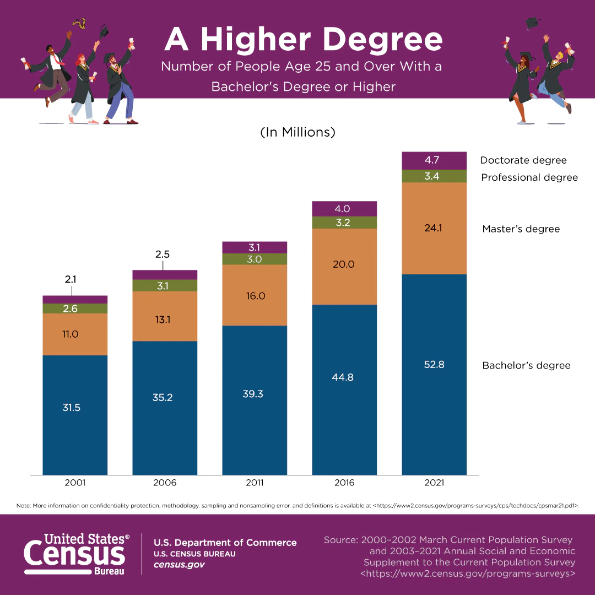

# Title of your Project: Project Proposal

**TODO**: Edit this file. Your project proposal goes here.

For what to do, see the [`../instructions/`](../instructions/) directory, specifically:

* [Design Brief](../instructions/project-design-brief.pdf)
* [Project Proposal Requirements](../instructions/p01-proposal-requirements.md)

## Code name
Give your project a code name, a short, evocative name for efficiently referring to your project. Your code name does not change! Examples: Jazz-4, Rocking Fish, etc.

## Project title
Give your project a concise, interesting title that summarizes the entirety of your project. (Your title can change on subsequent deliverables.)

## Authors
* Jacob Hilse: jhilse@uw.edu
* Megan Chiang: mjchiang@uw.edu
* Vincent Kao: hkao79@uw.edu
* Xuan Yi: xuany3@uw.edu

## Affiliation
INFO-201: Technical Foundations of Informatics - The Information School - University of Washington

## Date
Autumn 2022

## Abstract
We wanted to use this opportunity to investigate the highest level of education that Americans have received based on their demographics as well as time. We thought that this is important as one’s level of education received has an influence on their social status, however, the reverse relationship is true as well. We plan to create visualizations that can clearly demonstrate the differences on level of education received between different demographic groups as well as time periods and the effects that it may have.

Write a short abstract of three sentences. Your abstract should summarize your entire project, but only the very most important aspects. Here are two examples of how you might structure your abstract: (1) "Our main question is .... This question is important because .... To address the question, we will ...." and (2) "We are concerned with ..., because .... To address this concern, we plan to ...."

## Keywords
- Education
- College
- High School
- Demographics
- America

3-5 keywords that summarize your project. (e.g., "Keywords: human physiology; bicycle exercise; elderly; power and heart rate times-series data")

## Introduction
What is the relationship between people’s level of education received and their social status? We want to investigate this connection as it gives us insight as to whether the structure of the current system in place inflicts disadvantages on people of certain demographics. We thought that this is an important question to look into as there are a lot of job opportunities and employers are looking for highly educated and trained workers, and the need for these people as well as the imbalances in education levels between different groups of people can create an unjust spread of power that most people fail to recognize as privilege hazards. This matters to all of us since we all fall under different categorizations and groups, and understanding the current system is the only way that we can challenge it and create better and fairer opportunities for more people in the future.

## Problem Domain

- **Project Framing**

According to the [United Census Bureau](https://www.census.gov/newsroom/press-releases/2022/educational-attainment.html#:~:text=10.9%25%20in%202011.-,Sex,women%20and%2046.9%25%20were%20men.), the highest level of education for people in America has increased in recent history, as shown by this graphic.

That being said, while the entire population are receiving more education on average, this statistic does not show the disparity between different groups of people. We wanted to look into how severe this inequality is and how it affects different demographics in this project by working with data that will help us explore the correlations between different people, their levels of education received, and their social status.

- **Human Values**

Some values that are vital aspects in our project include, but are not limited to, education, opportunities, social status, economic well being, power, and

- **Stakeholders**

	- **Direct Stakeholders**

	- **Indirect Stakeholders**

- **Benefits**

- **Harms**

Use short sub-sections to describe your topic and the setting (that is, the sociotechnical situation), including project framing, human values, direct and indirect stakeholders, possible harms and benefits. See the Design Brief, section B.3. Note: You must include three citations to related work (URLs to similar work, high quality articles from the popular press, reseach papers, etc. ). You may find it helpful to include a figure. (About 400 words.)

## Research Questions
#### 1) Do the differences in demographics affect the highest level of education that people receive in America?
This question is important to us since being college students ourselves, we recognize that not everyone has the opportunity to do the same, and we want to bring light and attention as to what that difference is.

#### 2) How does one’s level of education received connect to their income?
In our rapidly advancing world, most good paying jobs and opportunities nowadays require some sort of high level education...

#### 3)
...

Present your 3-5 research questions. You should present each research question. For each research question, you should discuss why it is important and what motivates the question. (About 50 words for each question, so for four questions you would write about 200 words or more if needed.)

## The Dataset
(1) Describe how your dataset is related to your problem domain and, specifically, to your research questions. That is, how will your dataset enable you to answer your research questions? (2) Include a table that presents the name of each data file, the number of observations (rows), and the number of variables (columns). (3) Include a full citation to each data file, including URL. (4) Finally, describe the provenance of your dataset, addressing such key questions as: (a) Who collected the data? When? For what purpose? (b) How was the data collection effort funded? Who is likely to benefit from the data or make money? (c) How was the data validated and held secure? Is it credible and trustworthy? (d) How did you obtain the data? Do you credit the source of the data? (About 400 words.)

## Expected Implications
Proposal only. Assuming you answer your research questions, briefly describe the expected or possible implications for technologists, designers, and policymakers. (About 150 words.)

## Limitations
Proposal only. What limitations might you need to address? Briefly discuss. (About 150 words.)

## Acknowledgements
Is there anyone you would like to thank? A librarian who helped you with your research? A Teaching Assistant? A friend who helped you find your data? Say thank you in this section.

## References
Include your three or more research citations here. Also, include citations to your data files. Please use a standard citation style of your choice. See Citing Sources at the UW Library.

## Appendix A: Questions
Do you have questions for your TA or instructor? Include them here.
